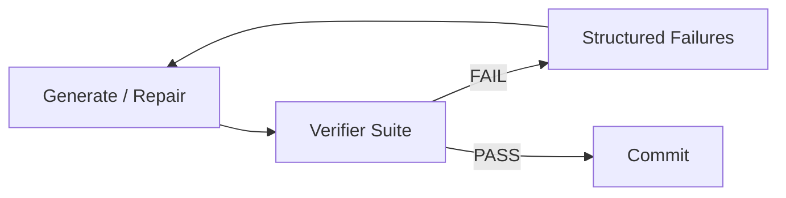

# Verification Loop

## Problem

LLM outputs are probabilistic; without **deterministic checks**, agents declare success based on narrative confidence alone. Subjective self-assessment misses failing tests, type errors, schema violations, and invariant breaks that cheap tooling catches reliably.

This pattern addresses the gap between "sounds correct" and "is correct."

## Solution

Drive iteration with **executable verifiers**: tests, linters, schema validators, property checks, or oracle queries. The loop is generate → verify → repair until all checks pass or budget exhausts. Verification results are structured feedback—not prose opinions—for the repair pass.

**Invariant**: the verdict function is external to the generator's self-report; `PASS` requires explicit check success signals.

## Architecture



| Component | Role |
|-----------|------|
| Generator | Produces or patches candidate artifact |
| Verifier suite | Ordered checks from cheap to expensive |
| Failure aggregator | Normalizes errors into repair hints |
| Quality gate | Minimum score or all-blocking-checks pass |
| Sandbox | Isolated execution for untrusted code |

## Workflow

1. Load task spec and define verification contract (tests, schemas, invariants).
2. Generate initial candidate solution or patch.
3. Run verifier suite; collect pass/fail per check with line-level diagnostics.
4. If any blocking check fails → feed structured failures to repair pass; goto 2.
5. On all blocking checks pass → optional soft-score evaluation for ranking.
6. Commit artifact; record verification trace for regression analysis.

## Pseudocode

```
function verification_loop(task, max_rounds=10):
    artifact = generate(task)
    for round in 1..max_rounds:
        results = verifier.run_all(artifact, checks=BLOCKING_FIRST)
        if results.all_blocking_pass():
            return SUCCESS(artifact, results)
        hints = results.to_repair_hints()
        artifact = repair(artifact, hints, task)
        if stagnation(artifact, hints):
            break
    return FAIL(artifact, results)
```

## Implementation Notes

- Order checks **cheap → expensive**: lint before integration tests before E2E.
- Verifier output schema: `{check_id, passed, severity, location, message, snippet}`.
- Prefer **minimal diffs** on repair passes; pass failing test names and stack traces verbatim.
- Separate blocking checks from advisory lint to avoid infinite style-fix loops.
- For non-code domains: use schema validation, citation URL HEAD requests, or golden-file comparison.
- Never let the generator mark its own homework—parse tool exit codes and test runners programmatically.

## Tradeoffs

| Pros | Cons |
|------|------|
| Ground truth from executable checks | Requires definable acceptance criteria |
| High precision for code and data tasks | Flaky tests cause false retry loops |
| Cheaper than multi-LLM critique | Cannot verify purely subjective goals alone |
| Clear stop condition | Upfront cost to write good verifiers |

## Failure Modes

| Mode | Signal | Mitigation |
|------|--------|------------|
| Test hacking | Generator weakens assertions | Mutation testing; review test diffs |
| Flaky verifier | Intermittent FAIL | Quarantine flaky checks; retry with seed |
| Overfitting loop | Passes tests, misses intent | Add property tests and spec cross-checks |
| Repair regression | Fixes one test, breaks others | Full suite every round; snapshot best candidate |
| False PASS | Verifier stub always green | Coverage thresholds; negative test cases |

## Taxonomy Level

**Level 2** — Reflective Loops. Run before or inside `reflection-loop`; pair with `critique-loop` for dimensions verifiers cannot encode.
