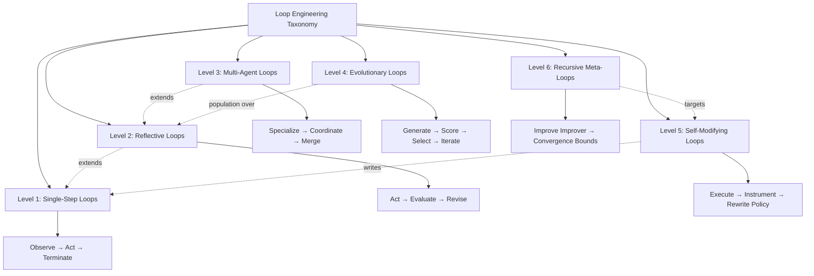

# Loop Engineering Taxonomy

Loop Engineering is the discipline of designing, composing, and governing **iterative agent workflows**—systems where an AI agent (or ensemble) repeatedly observes state, acts, and updates state until a termination condition is met. This taxonomy classifies loops by **cognitive depth**: how many layers of reasoning, reflection, coordination, or self-modification sit between a single action and the loop's outcome.

The six levels are **not mutually exclusive**. Production systems often combine levels (e.g., a Level 3 multi-agent debate wrapped in a Level 2 reflection gate). The taxonomy answers: *What kind of thinking happens inside each iteration?*

## Taxonomy Tree

## Level Summary

| Level | Name | Core Question | Typical Termination |
|-------|------|---------------|---------------------|
| 1 | Single-Step | Did the tool call succeed? | Success flag, max steps |
| 2 | Reflective | Is the output good enough? | Quality threshold, critique pass |
| 3 | Multi-Agent | Do specialists agree? | Consensus, orchestrator merge |
| 4 | Evolutionary | Which variant survives? | Fitness plateau, generation limit |
| 5 | Self-Modifying | Should the loop itself change? | Stability window, audit approval |
| 6 | Recursive Meta | Is the improvement process improving? | Meta-metric convergence, human charter |

## Complexity Dimensions

Every level adds cost along three axes:

- **Time**: wall-clock latency per iteration and total iterations to convergence.
- **Space**: memory of transcripts, artifacts, population members, and policy versions retained.
- **Tokens**: LLM input/output volume—including hidden retries, critiques, and inter-agent messages.

Higher levels trade **predictability and cost** for **quality ceiling and adaptability**. Level 1 loops are appropriate when the task is procedural and verifiable; Level 6 is reserved for research harnesses and long-horizon autonomy with explicit safety envelopes.

## How to Use This Taxonomy

1. **Classify your current harness** by the deepest cognitive layer that runs *inside* the iteration (not post-hoc human review).
2. **Match patterns** in `../patterns/` to the level you need—patterns are reusable compositions, levels are capability tiers.
3. **Escalate deliberately**: jumping from Level 1 to Level 4 without measurement usually wastes tokens; add reflection (L2) before populations (L4).
4. **Document termination**: each level file specifies default stop conditions and failure signatures.

## Level Documentation

| Document | Focus |
|----------|-------|
| [level-1-single-step-loops.md](./level-1-single-step-loops.md) | Tool-use cycles, ReAct-style agents |
| [level-2-reflective-loops.md](./level-2-reflective-loops.md) | Self-critique, verification gates |
| [level-3-multi-agent-loops.md](./level-3-multi-agent-loops.md) | Roles, orchestration, debate |
| [level-4-evolutionary-loops.md](./level-4-evolutionary-loops.md) | Populations, selection, mutation |
| [level-5-self-modifying-loops.md](./level-5-self-modifying-loops.md) | Prompt/skill/hook rewrites |
| [level-6-recursive-meta-loops.md](./level-6-recursive-meta-loops.md) | Meta-optimization, convergence theory |

## Design Principles Across Levels

**Idempotent state transitions.** Each iteration should declare what changed in world state vs. internal state. Ambiguous merges cause infinite retry loops at Level 2+.

**Explicit budgets.** Token, step, and dollar budgets are first-class termination inputs—not afterthoughts when the loop runs away.

**Observable iterations.** Log structured events: `{iteration, level, action, outcome, cost}`. Meta-loops (L6) require this telemetry to optimize lower layers.

**Fail closed on ambiguity.** When a reflective or multi-agent loop cannot reach consensus, prefer halting with a partial artifact over silent degradation.

## Related Work

This taxonomy synthesizes patterns from ReAct, Reflexion, Generators/Critics, multi-agent debate, evolutionary prompt optimization, DSPy-style compilation, and recursive self-improvement research—organized for **engineering** rather than paper taxonomy.
