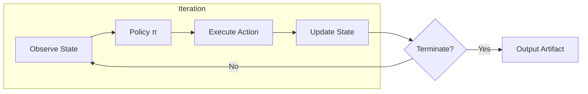

# Level 1: Single-Step Loops

## Definition

A **single-step loop** executes a fixed cycle: **observe environment state → select one action → apply action → check termination**. There is no internal quality model, no second agent, and no revision of prior reasoning except what the next observation implicitly provides. Each iteration is cognitively shallow: the agent treats the task as a sequence of independent decisions conditioned on the latest context window.

Formally, let state \(S_t\) be the union of external observations and scratch memory at step \(t\). A Level 1 loop implements:

\[
S_{t+1} = T(S_t, a_t), \quad a_t = \pi(S_t)
\]

where \(\pi\) is the policy (prompt + model + tool routing) and \(T\) is the transition function (tool execution, file write, API call). Termination occurs when `stop(S_t)` is true—typically a success predicate, empty todo list, or step budget exhaustion.

## Architecture



**Components:**

| Component | Responsibility |
|-----------|----------------|
| **State store** | Messages, tool results, file snapshots, cursor position |
| **Policy** | System prompt + model routing + tool schema |
| **Action executor** | Sandboxed shell, MCP tools, browser, code edit |
| **Stop predicate** | Max steps, explicit DONE signal, goal detector |

**Control flow** is strictly linear within an iteration. Branching happens only at termination check and tool error handlers (retry vs. abort).

## Use Cases

- **File-scoped coding tasks**: read file → patch → run test → repeat until green.
- **Data extraction pipelines**: paginate API → normalize row → append to store.
- **Operational runbooks**: check service health → restart if unhealthy → verify.
- **Interactive CLI agents**: user message → tool calls → assistant reply (chat as outer loop).
- **CI fix bots**: parse failure log → apply minimal fix → push (with human merge gate outside loop).

## Strengths

- **Low latency**: one model call (+ tool I/O) per iteration in the common case.
- **Predictable cost**: tokens ≈ `(context + action) × steps`; easy to cap.
- **Simple debugging**: linear trace maps 1:1 to user-visible progress.
- **Composability**: Level 1 loops nest cleanly as nodes inside higher-level graphs.
- **Deterministic tooling**: when tools are pure, replay from logged actions is straightforward.

## Weaknesses

- **No quality gate**: wrong-but-plausible outputs propagate until an external verifier fails—or never.
- **Local optima**: without reflection, agents repeat similar failed actions (tool call loops).
- **Context drift**: long traces dilute instructions; no structured "reset reasoning" phase.
- **Brittle stop conditions**: `DONE` hallucination or premature stop are common failure modes.
- **Single perspective**: no adversarial or specialist challenge to initial plan.

## Complexity Analysis

### Time

- **Per iteration**: \(O(1)\) model calls in the baseline; \(O(k)\) if \(k\) parallel tool calls are allowed.
- **Total**: \(O(n \cdot (T_{\text{LLM}} + T_{\text{tool}}))\) for \(n\) steps until termination.
- **Worst case**: unbounded if stop predicate is never satisfied; always enforce `max_steps`.

### Space

- **Transcript growth**: \(O(n \cdot \bar{m})\) where \(\bar{m}\) is average message size per step.
- **External artifacts**: unbounded if the agent writes files without pruning; use rolling summaries for long runs.

### Tokens

- **Input**: grows linearly with full-history prompting—dominant cost at high \(n\).
- **Output**: roughly constant per step (action + short rationale).
- **Rule of thumb**: Level 1 runs at **1×–1.5×** the token cost of a single-shot answer for the same task when \(n \leq 5\); beyond that, compaction dominates economics.

## Examples

### Example A: ReAct-style bug fix

```
Iteration 1: read test output → identifies ImportError
Iteration 2: read source file → locates missing import
Iteration 3: apply patch → run pytest
Iteration 4: tests pass → emit DONE
```

No critique step; success is **tool-verified** (exit code 0).

### Example B: Stuck tool loop (failure signature)

```
Iteration 5–12: grep same pattern → edit same line → test still fails
```

Without Level 2 reflection, the agent lacks a forced "why did my hypothesis fail?" phase.

### Example C: Outer human loop

Chat UI where the user sends messages is **Level 1 per turn** with human as implicit verifier—still Level 1 inside each turn if the agent does not self-critique.

## When to Escalate

Add Level 2 when:

- Success criteria are **subjective** (tone, design, security posture).
- Tool verification is **delayed or noisy** (flaky tests, partial logs).
- Repeated failures share a **pattern** suggesting plan-level error, not execution error.

## Implementation Checklist

- [ ] Hard `max_steps` and `max_tool_calls` in harness config
- [ ] Structured logging: `{step, tool, args_hash, latency_ms, ok}`
- [ ] Context compaction policy after \(N\) steps (summary, not raw truncation)
- [ ] Stop predicate requires **evidence** (test pass, file hash, API 200)—not model assertion alone
