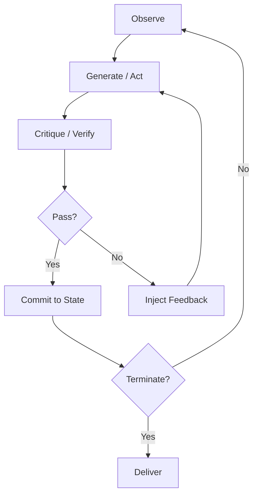

# Level 2: Reflective Loops

## Definition

A **reflective loop** inserts an **evaluation phase** between action and continuation. After producing a candidate output or action batch, the agent (or a dedicated critic module) assesses quality against explicit criteria, then either **accepts**, **revises**, or **replans**. Reflection can be intra-agent ("review your work") or dual-module (generator + critic).

Formally:

\[
\text{candidate}_t = \pi_g(S_t), \quad r_t = \pi_c(S_t, \text{candidate}_t)
\]
\[
S_{t+1} = \begin{cases}
T(S_t, \text{candidate}_t) & \text{if } r_t = \text{pass} \\
S_t' + \text{feedback}(r_t) & \text{if } r_t = \text{revise}
\end{cases}
\]

Level 2 adds a **meta-cognitive layer** without requiring multiple agents or population search.

## Architecture



**Variants:**

| Variant | Critic | Cost | Quality lift |
|---------|--------|------|--------------|
| Self-reflection | Same model, new prompt | 1.5–2× | Moderate |
| Dual-model | Cheap critic / expensive generator | 1.3–2.5× | High on code |
| Tool-verified | Tests, linters, static analysis | Variable | High when tools exist |
| Rubric-scored | Structured JSON scores | 2×+ | Good for content |

## Use Cases

- **Code generation with test gates**: implement → run tests → reflect on failures → patch.
- **Long-form writing**: draft → checklist critique (accuracy, structure, voice) → revise.
- **Security-sensitive edits**: change → SAST scan → remediate findings before commit.
- **Plan-and-execute**: planner output → feasibility critic → executor only after pass.
- **Reflexion-style episodic memory**: store reflection strings across attempts within a session.

## Strengths

- **Quality ceiling** rises without multiplying agents—good ROI for many tasks.
- **Actionable feedback**: structured critique gives the generator a gradient, not just failure.
- **Composable with L1**: reflection wraps any single-step executor.
- **Tool-aligned**: when critic is deterministic (tests), reflection reduces hallucinated "done".
- **Debuggability**: critique transcripts explain *why* a revision occurred.

## Weaknesses

- **Critique blind spots**: model critic shares generator biases; may approve subtle bugs.
- **Oscillation**: revise loops alternate between two equivalent bad solutions.
- **Token inflation**: each failed pass duplicates context + prior draft.
- **Latency stacking**: sequential generate-then-critique doubles wall-clock per iteration.
- **Rubber-stamp risk**: weak prompts produce `"looks good"` critiques always.

## Complexity Analysis

### Time

- **Per iteration**: \(O(g + c)\) model calls where \(g\) is generation depth and \(c\) is critique depth (often 1 each).
- **With tools**: critique may include \(O(t)\) test runs—can dominate LLM time.
- **Total**: \(O(n \cdot (T_g + T_c + T_{\text{verify}}))\); typically **2×–3×** Level 1 for same task.

### Space

- **Draft retention**: store latest candidate + critique history; \(O(n \cdot d)\) for draft size \(d\).
- **Episodic reflections**: optional memory of past failures—bounded ring buffer recommended.

### Tokens

- **Input**: generator context + full draft on each critique pass—**super-linear** if drafts are long.
- **Output**: critique JSON + revision deltas.
- **Typical multiplier**: **2×–4×** Level 1 tokens for subjective tasks; **1.2×–2×** when critic is mostly tool output (short).

Mitigation: **delta critique** ("list only blocking issues"), **tiered critics** (cheap screen → expensive deep review).

## Examples

### Example A: Test-driven reflection

```
Generate: implement sort function
Critique: pytest → 2 failures (edge case empty list, stability)
Revise: patch handling for [] and equal keys
Critique: pytest → pass
Commit + terminate
```

### Example B: Rubric reflection (content)

```json
{
  "accuracy": 4,
  "completeness": 3,
  "blocking_issues": ["Claim in §2 unsourced"],
  "verdict": "revise"
}
```

Generator revises §2 only—scoped revision reduces token burn.

### Example C: Oscillation failure

```
v1: uses global variable → critic flags style
v2: passes params → critic flags performance
v3: reintroduces global → loop until max_reflect_steps
```

**Fix**: require monotonic progress metric or human escalation.

## Relation to Patterns

Level 2 maps directly to: `reflection-loop`, `critique-loop`, `verification-loop`, `planning-loop` (plan critique before execute).

## When to Escalate

- **To Level 3** when critique needs **independent specialist perspectives** (security vs. UX vs. perf).
- **To Level 4** when many **diverse candidates** should be explored in parallel, not serial revision.
- **Stay at Level 2** when verification tools are strong and task is single-domain.

## Implementation Checklist

- Separate prompts: `GENERATOR_SYSTEM` vs `CRITIC_SYSTEM` (critic must not auto-approve)
- `max_reflect_rounds` independent of `max_steps`
- Critique schema with **blocking vs. nit** classification
- Abort on repeated identical critique verdicts (loop detector)
