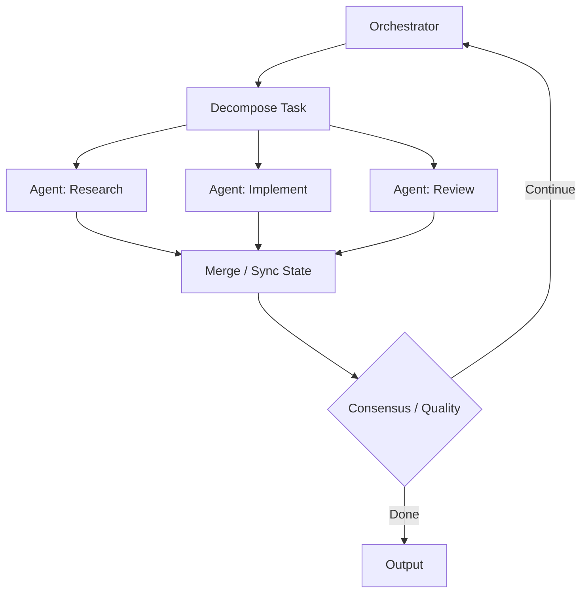
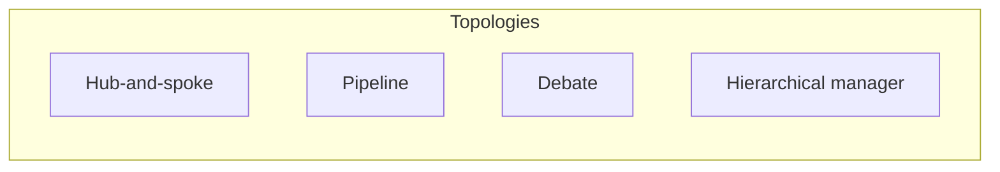

# Level 3: Multi-Agent Loops

## Definition

A **multi-agent loop** distributes iterations across **multiple roles** with distinct prompts, tools, or models. An orchestrator coordinates message passing, task decomposition, and merge logic. Each macro-iteration may involve parallel specialist work, sequential handoffs, or debate until consensus.

Formally, agents \(\{A_1, \ldots, A_k\}\) share or partition state:

\[
M_t = \text{merge}\big(\{A_i.\text{step}(S_t^{(i)}, \text{msg}_t)\}_{i=1}^{k}\big)
\]

Level 3 adds **social cognition**: disagreement, specialization, and division of labor—not just self-critique.

## Architecture



**Orchestration topologies:**



| Topology | Best for | Failure mode |
|----------|----------|--------------|
| Hub-and-spoke | Dynamic task routing | Orchestrator bottleneck |
| Pipeline | ETL-style workflows | Error propagation downstream |
| Debate | Ambiguous decisions | Talking past each other |
| Hierarchical | Large projects | Middle-manager drift |

## Use Cases

- **Software delivery**: PM agent → coder → reviewer → release agent with gated merges.
- **Research synthesis**: searcher gathers sources → analyst summarizes → fact-checker validates.
- **Red team / blue team**: attacker proposes exploits → defender patches → judge scores.
- **Customer support escalation**: L1 agent → specialist → supervisor approval.
- **Parallel implementation**: N coders on disjoint modules → integrator merges.

## Strengths

- **Specialization**: narrow prompts and tool sets per role improve accuracy.
- **Diversity**: independent models reduce shared blind spots vs. single self-critique.
- **Parallelism**: wall-clock reduction when tasks partition cleanly.
- **Governance**: human approval agent as explicit role in regulated workflows.
- **Scalable complexity**: new roles attach without rewriting monolithic prompt.

## Weaknesses

- **Coordination overhead**: inter-agent messages explode token use.
- **Inconsistent world model**: agents act on stale or conflicting state snapshots.
- **Merge conflicts**: integrator may silently drop dissenting findings.
- **Cost unpredictability**: fan-out parallelism multiplies spend.
- **Debugging difficulty**: distributed traces require correlation IDs across agents.

## Complexity Analysis

### Time

- **Parallel fan-out**: wall-clock ≈ \(\max_i T_i\) + merge time (ideal).
- **Sequential pipeline**: \(O(\sum_i T_i)\) per macro-iteration.
- **Debate**: \(O(r \cdot k)\) for \(r\) rounds and \(k\) agents—often **3×–10×** single-agent latency.

### Space

- **Per-agent context**: \(O(k \cdot m)\) for message volume \(m\); shared blackboard reduces duplication but needs access control.
- **Artifact versioning**: branch-per-agent merge strategies need \(O(k \cdot a)\) artifact storage.

### Tokens

- **Message passing tax**: every handoff re-serializes prior work—**dominant cost** at Level 3.
- **Rule of thumb**: **3×–8×** Level 1 for 3-agent pipeline; debate with 4 agents × 3 rounds can exceed **20×**.
- **Mitigation**: structured handoff schemas (facts, decisions, open questions only—not full logs).

## Examples

### Example A: Hub orchestrator (coding)

```
Orchestrator: assigns "implement auth middleware"
Implementer: writes code, posts diff summary
Reviewer: requests changes on token expiry handling
Orchestrator: reassigns implementer with scoped feedback
Reviewer: approve → Orchestrator: merge
```

### Example B: Debate (architecture choice)

```
Advocate A: SQLite for simplicity
Advocate B: Postgres for concurrency
Judge: scores against NFR doc → selects Postgres with migration plan
```

### Example C: State divergence failure

Researcher cites deprecated API; Implementer uses current API; Reviewer passes—integration fails in CI.

**Fix**: shared **facts ledger** with timestamps; implementer must cite ledger IDs.

## Relation to Patterns

Maps to: `debate-loop`, `multi-agent-coordination`, `human-in-the-loop`, `planning-loop` (multi-role planning).

## When to Escalate

- **To Level 4** when you need **many candidate solutions** scored in parallel (population), not role-based process.
- **To Level 2 only** if roles are cosmetic (same model, same tools)—true multi-agent needs **divergent policies**.
- **From Level 2** when single critic cannot cover orthogonal concerns (security + UX + legal).

## Implementation Checklist

- Correlation ID per macro-iteration across all agent logs
- Handoff schema: `{goal, facts[], decisions[], open_questions[], artifacts[]}`
- Stale-read detection: version field on shared state
- Budget per role and global ceiling
- Explicit merge authority (one writer to canonical branch)
