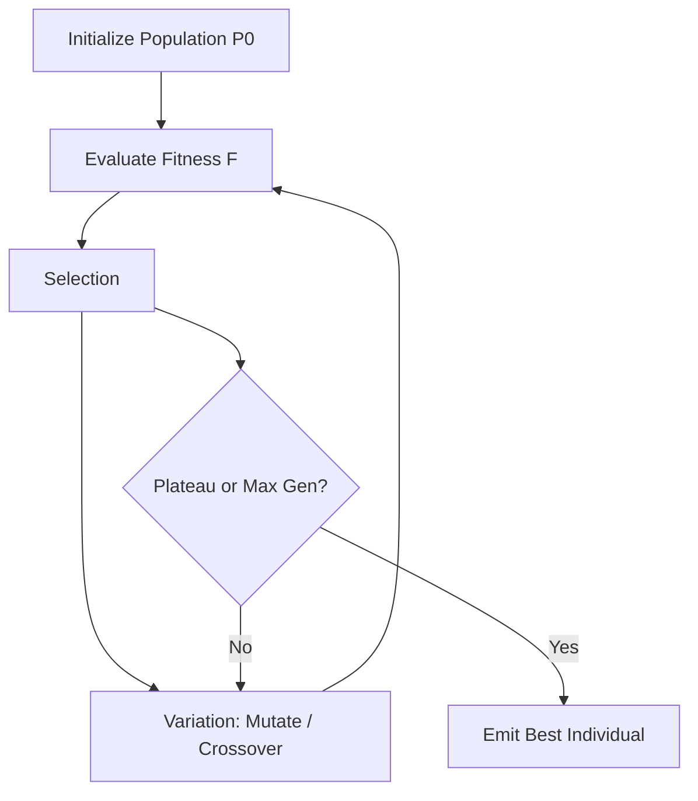
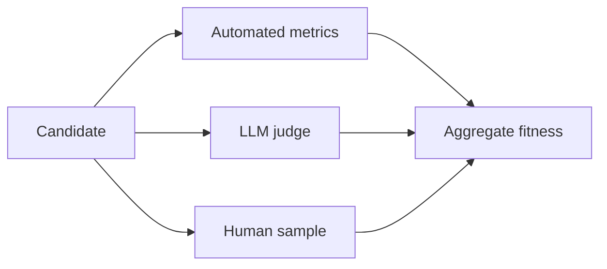

# Level 4: Evolutionary Loops

## Definition

An **evolutionary loop** maintains a **population** of candidates (prompts, plans, code variants, agent configs) across generations. Each generation: **generate variants → evaluate fitness → select survivors → mutate/crossover → repeat**. Selection pressure comes from automated metrics, human ratings, or multi-objective scores.

Unlike Level 2 serial revision, Level 4 explores **parallel niches** in solution space. Unlike Level 3 role division, Level 4 competes **homogeneous or parameterized variants** on outcome quality.

Formally, generation \(g\):

\[
P_g = \{x_1, \ldots, x_N\}, \quad f_i = F(x_i), \quad P_{g+1} = \text{breed}(\text{select}(P_g, f))
\]

## Architecture



**Fitness evaluation layers:**



## Use Cases

- **Prompt optimization**: evolve system prompts against held-out eval set.
- **Program synthesis**: mutate AST snippets; unit tests as fitness.
- **Hyperparameter / routing search**: model choice, temperature, tool policies.
- **GAN-style harnesses**: generator produces app; evaluator scores rubric; iterate designs.
- **Architecture search**: evolve DAG of agent nodes for a benchmark suite.

## Strengths

- **Escapes local optima** that trap serial reflection.
- **Measurable progress**: fitness curves expose whether search is working.
- **Parallelizable evaluation**: candidates often score independently on GPUs/workers.
- **Reproducible artifacts**: store population lineage for audit.
- **Multi-objective**: Pareto fronts trade latency vs. quality vs. cost.

## Weaknesses

- **Evaluation cost**: fitness function may require full agent runs per individual.
- **Reward hacking**: agents overfit to shallow metrics (length, keyword presence).
- **Unsafe mutations**: code evolution can produce destructive side effects without sandbox.
- **Slow convergence**: many generations needed; impractical for interactive UX.
- **Interpretability**: winning variant may be brittle or non-transferable.

## Complexity Analysis

### Time

- **Per generation**: \(O(N \cdot T_{\text{eval}})\) for population size \(N\).
- **With parallel workers**: wall-clock ≈ \(O(G \cdot T_{\text{eval}} / W)\) for \(G\) generations, \(W\) workers.
- **Total**: often **10×–1000×** single-shot task time for serious search.

### Space

- **Population storage**: \(O(N \cdot |x|)\) per generation; lineage trees multiply if all history kept.
- **Eval artifacts**: logs, screenshots, test reports—**dominant** for code evolution.

### Tokens

- **Mutation operators** using LLMs: \(O(N \cdot \bar{t})\) tokens per generation for proposals.
- **LLM-as-judge**: doubles eval cost if every individual gets narrative scoring.
- **Typical**: **50×–500×** Level 1 for prompt evolution on 20-item eval; highly variable.

**Efficiency tactics**: hierarchical evaluation (cheap filter → expensive full run), caching fitness for unchanged genomes, island models.

## Examples

### Example A: Prompt evolution (OPRO-style)

```
Gen 0: 8 prompt variants from seed + mutations
Eval: accuracy on 50 QA pairs → best 0.72
Gen 3: crossover top-2 + mutate → best 0.81
Gen 8: plateau → deploy prompt v8
```

### Example B: Code mutation with tests

```
Individual: sorting function variant
Fitness: pass_rate on 100 property tests + perf penalty
Gen 5: discovers quicksort; Gen 12: adds stable tie-break
```

### Example C: Reward hacking

```
Fitness: "response includes word 'secure'"
Evolved prompt: repeats 'secure' 40 times; accuracy drops
```

**Fix**: composite fitness + hold-out set + penalty for length.

## Relation to Patterns

Maps to: `optimization-loop`, `exploration-loop`, `simulation-loop` (fitness via simulation), GAN-style generator/evaluator in patterns catalog.

## When to Escalate

- **To Level 5** when the **search space includes the evolution algorithm itself** (mutation policy, selection ratio).
- **To Level 3** when diversity comes from **expert roles**, not variant competition.
- **Down to Level 2** when \(N=1\) serial improve is enough and eval is expensive.

## Implementation Checklist

- Sandboxed eval for any executable genome
- Train/hold-out split; never select on hold-out until final report
- Log `{gen, id, parent_ids, fitness_vector, hash}`
- Early stopping on fitness plateau + minimum generation count
- Human review gate before deploying evolved prompts to production
