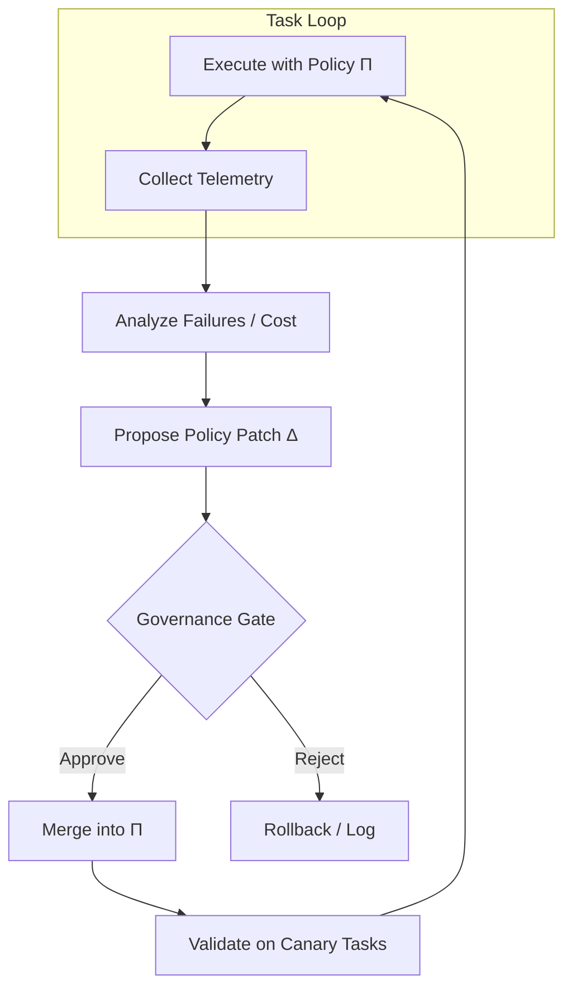

# Level 5: Self-Modifying Loops

## Definition

A **self-modifying loop** can **rewrite its own control policy** between or during iterations: system prompts, tool manifests, skill files, routing rules, hooks, memory schemas, or orchestration graphs. The agent observes execution telemetry, diagnoses policy deficiencies, and emits **patches to the harness**—not merely patches to the user's task artifact.

Formally, policy \(\Pi_t\) evolves:

\[
\text{outcome}_t = \text{run}(\Pi_t, \text{task}), \quad \Pi_{t+1} = \Pi_t \oplus \Delta_t
\]

where \(\Delta_t\) is a governed update (diff to prompt file, new hook, adjusted stop condition) and \(\oplus\) is merge under safety constraints.

Level 5 is **meta to the task loop**: the loop engineer and the loop executor collapse into one system—with attendant risk.

## Architecture



**Modification targets:**

| Target | Example change | Risk |
|--------|----------------|------|
| System prompt | Add "always run tests" | Low |
| Tool ACL | Grant network access | High |
| Hooks | Auto-commit on green | Medium |
| Skills | New verification skill | Medium |
| Routing | Cheaper model for subtasks | Low |
| Termination | Raise max_steps | Medium (runaway) |

## Use Cases

- **Harness optimizer**: agent edits its own `.cursor/rules` after repeated CI failures.
- **Skill distillation**: successful session → new SKILL.md for future runs.
- **Dynamic tool loading**: enable browser MCP only when task classifies as UI bug.
- **Cost controller**: switch model tier when token budget > 80%.
- **Continuous learning hooks**: instinct files updated from post-session analysis (with human review).

## Strengths

- **Adaptation without redeploy**: policy improves from production traces.
- **Institutional memory**: codified lessons reduce repeated mistakes.
- **Personalization**: per-repo or per-user policy tuning.
- **Closed-loop SRE**: hooks adjust retries, timeouts from latency stats.

## Weaknesses

- **Safety**: self-granted permissions enable exfiltration or destructive automation.
- **Instability**: oscillating policies (add rule → remove rule) confuse downstream runs.
- **Audit burden**: who approved \(\Delta_t\)? diff must be human-readable.
- **Overfitting to session**: one weird failure shouldn't rewrite global prompt.
- **Version skew**: task artifacts assume old policy; replay breaks.

## Complexity Analysis

### Time

- **Policy analysis pass**: +1–3 LLM calls per task loop exit.
- **Canary validation**: multiplies time by canary suite size \(c\).
- **Total overhead**: **+20%–200%** per session depending on governance depth.

### Space

- **Policy versioning**: Git-like history of \(\Pi_t\); recommend immutable commits.
- **Telemetry store**: traces for diagnosis—GB-scale at scale.

### Tokens

- **Meta prompts** include failure logs + current policy text—can exceed task tokens.
- **Typical**: **1.5×–5×** task-only tokens when modification runs every session.
- **Bounded meta budget**: cap analysis context to last \(k\) failures + policy diff summary.

## Examples

### Example A: Skill creation

```
Session: agent repeatedly looked up JWT refresh patterns
Analysis: propose auth-jwt-refresh SKILL.md
Governance: human approves PR
Next session: skill auto-loaded → fewer search steps
```

### Example B: Dangerous self-modification

```
Agent adds hook: "on any error, rm -rf node_modules && reinstall"
Trigger: transient network blip → destructive loop
```

**Fix**: deny-list destructive commands in hook sandbox; require human merge for hooks.

### Example C: Stable policy convergence

```
Week 1: 12 policy patches, high variance in task success
Week 4: 1 patch/month, metrics flat → enter maintenance mode
```

## Relation to Patterns

Maps to: `memory-augmented-loop`, `recursive-improvement-loop` (limited form), `safety-constrained-loop` (required envelope).

## When to Escalate

- **To Level 6** when optimizing **how optimization works** (meta-meta: selection of analysis prompts, governance thresholds).
- **Stay at Level 5** with strong gates for production; never skip canary + approval for permission changes.

## Implementation Checklist

- Separate **policy repo** from **task workspace** (PR-based merges)
- Immutable audit log: `{timestamp, Δ, author, reason, metrics_before, metrics_after}`
- Canary eval suite run before \(\Pi_{t+1}\) becomes default
- Automatic rollback if canary regression > threshold
- Hard deny-list on modifiable surfaces (secrets, billing, production deploy)
