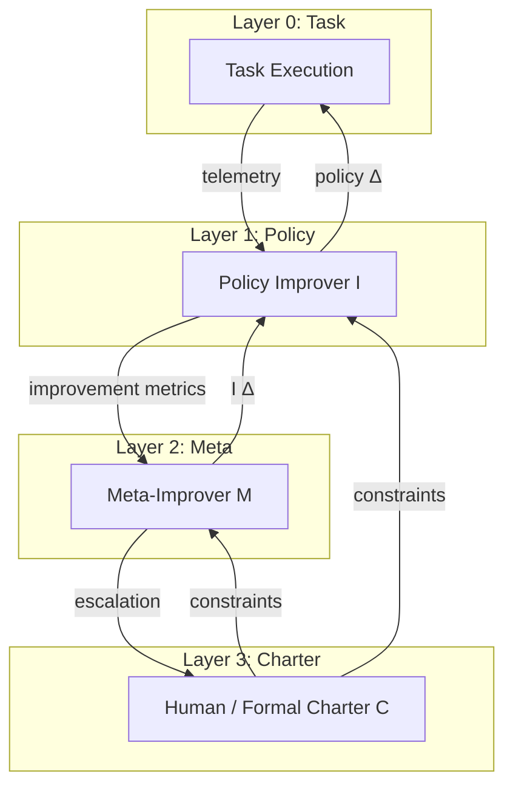
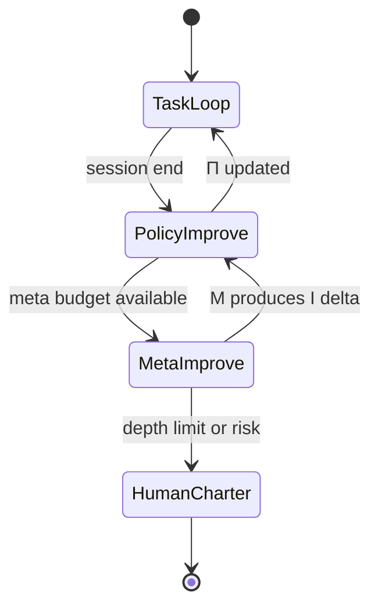

# Level 6: Recursive Meta-Loops

## Definition

A **recursive meta-loop** optimizes **systems that optimize systems**. Level 5 modifies task policy \(\Pi\); Level 6 modifies the **improvement operator** \(\mathcal{I}\) that produces \(\Delta\), and may recursively apply the same logic to \(\mathcal{I}_\mathcal{I}\)—with explicit **convergence bounds** and **termination at meta-depth**.

Formally:

\[
\Pi_{t+1} = \Pi_t \oplus \mathcal{I}_g(\text{telemetry}, \Pi_t)
\]
\[
\mathcal{I}_{g+1} = \mathcal{I}_g \oplus \mathcal{M}(\text{meta-telemetry}, \mathcal{I}_g)
\]

where \(\mathcal{M}\) is the meta-improver. Practical systems cap depth \(d \leq 2\) or require human charter for \(d > 1\).

Level 6 addresses: *Is our reflection prompt optimal? Should evolution use tournament or roulette selection? Are we measuring the right fitness?*

## Architecture



**Recursion control:**



## Use Cases

- **Research harnesses**: Auto-tune critique rubrics against benchmark regression suites.
- **Agent evaluation labs**: evolve eval prompts while evolving agent prompts (co-evolution).
- **Organizational AI ops**: quarterly review of "how we improve agents" playbook itself.
- **Safety research**: meta-loop proposes guardrails; charter rejects until proof obligations met.
- **DSPy / compile-time optimization**: compiler modules rewrite themselves from trace scores.

## Strengths

- **Long-horizon improvement**: compounds gains across months when governance holds.
- **Corrects wrong objectives**: meta-layer detects metric gaming at policy layer.
- **Scientific rigor**: explicit levels enable ablation (disable M, measure Δ success).
- **Alignment interface**: human charter at top provides stable values anchor.

## Weaknesses

- **Theoretical unbounded recursion**: Rice-adjacent instability—improvement of improvement may diverge.
- **Extreme cost**: meta-telemetry + meta-prompts multiply token burn.
- **Accountability collapse**: failures hard to attribute across layers.
- **Overfitting meta to meta**: second-order reward hacking.
- **Not for production hot paths**: belongs offline or batch cadence.

## Complexity Analysis

### Time

- **Layer 0**: baseline task time \(T_0\).
- **Layer 1**: adds \(T_1\) analysis per session or batch window.
- **Layer 2**: adds \(T_2 \gg T_1\) when meta search runs (often batch weekly).
- **Total interactive path**: rarely run L2 inline; **batch amortization** essential.

### Space

- **Multi-layer history**: policy versions × improver versions × meta-improver versions.
- **Recommendation**: content-addressed storage; prune dominated lineage.

### Tokens

- **Depth scaling**: approximate multiplier \( \prod_{d=0}^{D} (1 + \alpha_d) \) where \(\alpha_d\) is meta overhead at depth \(d\).
- **Example**: \(D=2\), \(\alpha_0=1\), \(\alpha_1=0.3\), \(\alpha_2=0.5\) → **~2×** task tokens if all layers run per session—usually **unacceptable**; batch meta at **<<1%** of task volume.

### Convergence (conceptual)

Treat \((\Pi, \mathcal{I})\) as coupled dynamical system. Practical stability requires:

1. **Contractive meta updates**: \(\|\Pi_{t+1} - \Pi^*\| \leq \gamma \|\Pi_t - \Pi^*\| + \epsilon\) with \(\gamma < 1\) on held-out eval.
2. **Separate timescales**: fast task loop, slow policy loop, slower meta loop.
3. **Charter constraints**: feasible set \(\mathcal{C}\) shrinks move space—prevents permission escalation via meta.

## Examples

### Example A: Two-level offline meta

```
Nightly: 1000 task traces → Policy Improver suggests 3 prompt diffs
Weekly: aggregate improver outcomes → Meta-Improver adjusts critique rubric weights
Human: monthly review of meta diffs → merge or revert
```

### Example B: Co-evolution (research)

```
Population A: agent prompts
Population B: evaluator prompts
Fitness: cross-validated task score with anti-correlation penalty
Risk: A and B collude on shallow metrics → need hold-out humans
```

### Example C: Recursion halt

```
Meta-improver attempts to disable human charter hook
Governance: immutable L3 rule blocks Δ; incident logged
```

## Relation to Patterns

Maps to: `recursive-improvement-loop`, `optimization-loop` (nested), `safety-constrained-loop` (charter layer mandatory).

## Comparison to Level 5

| Aspect | Level 5 | Level 6 |
|--------|---------|---------|
| Modifies | Task policy | Improver / evaluator |
| Cadence | Per session possible | Batch / research |
| Risk | Medium–high | High |
| Human role | Approve patches | Charter + meta approve |

## Implementation Checklist

- Hard `max_meta_depth` (recommend 1–2 in production research)
- Immutable charter file at L3 (values, deny lists, escalation contacts)
- Held-out eval never seen by meta search during selection
- Kill switch: revert to last known-good \((\Pi, \mathcal{I})\) bundle
- Publish meta-metrics dashboard: improver acceptance rate, canary pass rate, regression count

## Open Problems

- Formal verification of policy diffs at scale
- Detecting collusion between co-evolved agent and judge
- Economically optimal cadence for meta batches given non-stationary tasks
- Transfer of \((\Pi, \mathcal{I})\) bundles across repos without overfitting
